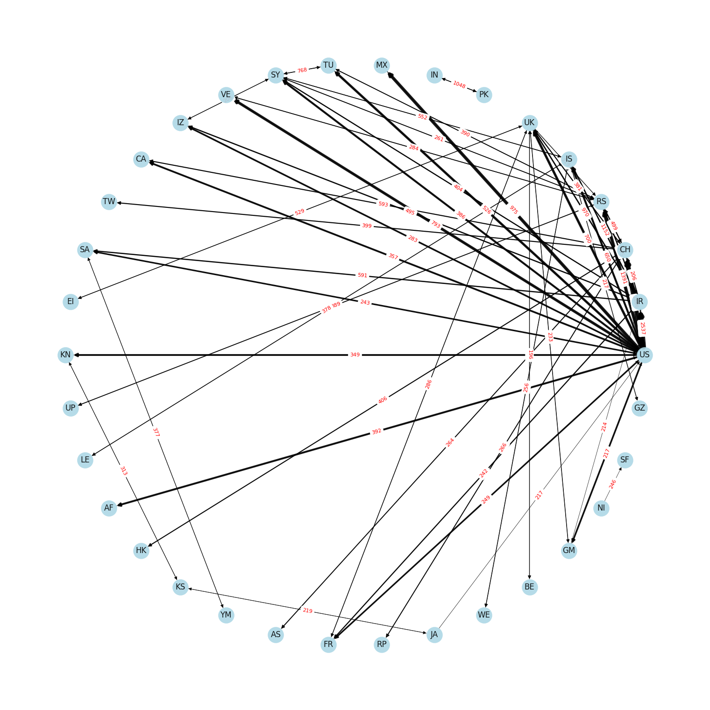

# About 

Using Apache Spark on Azure Databricks to analyze a dataset from the [Registry of Open Data on AWS](https://registry.opendata.aws/).

The dataset is taken from the [GDELT project](https://www.gdeltproject.org/), which is a "realtime open data global graph over human society" that monitors a comprehensive selection of the world's web news.

- GraphFrames and [NetworkX](https://networkx.org/) is used to generate and visualize a graph or the top threators globally. All GDELT data from 2019 is used for the analysis.

- A graph with circular layout is generated for the top N threat emitters

- The source code for the data ingest and anlysis can be found here:
  - [Databricks Notebook](./threat-analysis.py)
  - [Jupyter Notebook](./threat-analysis.ipynb)
  
## Most frequent threators globally

# References

[GDELT project](<https://www.gdeltproject.org>)

[GDELT Events Data Schema](<https://www.gdeltproject.org/data/lookups/SQL.tablecreate.txt>)

<http://alvinalexander.com/source-code/scala-java-lang-nosuchmethoderror-compiler-message/>

<https://databricks.com/blog/2019/12/05/processing-geospatial-data-at-scale-with-databricks.html>

<https://docs.databricks.com/spark/latest/graph-analysis/graphframes/graph-analysis-tutorial.html>